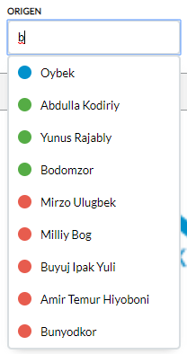
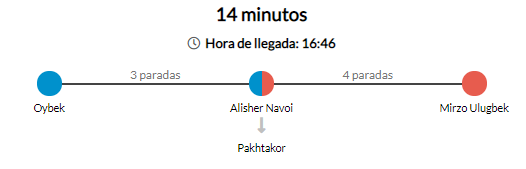

# Instalación

Primero es necesario instalar Python 3.7 y tener instalado pip para poder instalar los paquetes necesarios.
Buscad en internet como instalarlo.
<br>

#### Pasos

##### Paso 1 (OPCIONAL)

Ejecutamos el siguiente comando para crear un entorno virtual:

```
pip install virtualenv
```

Cuando se instale ejecutamos:

```
virtualenv venv
```

Ahora ya tenemos creado un entorno virtual, para ejecutarlo realizamos:

```
(LINUX):    source venv/bin/activate
(WINDOWS):  .\venv\Scripts\activate
```

##### Paso 2

Instalamos los paquetes necesarios

```
pip install -r requirements.txt
```

##### Paso 3

Ejecutamos el servidor

```
flask run
```

##### Paso 4

Abrir el navegador con la ruta: http://localhost:5000

##### Paso 5 (OPCIONAL)

Para evitar tener que reiniciar el servidor manualmente cada vez que se realiza un cambio en recomendable activar el hot reload de la siguiente forma:

```
(LINUX):    export FLASK_DEBUG=1
(WINDOWS):  set FLASK_DEBUG=1
```

<br>

# Documentación para la API

### Obtener todas las líneas

```
GET /

```

devuelve

```
body: {
  stations: {
    "blue": [
      {
        name: string;
        x: int;
        y: int;
        connected_to: string[];
      }
    ],
    "red": [
      {
        name: string;
        x: int;
        y: int;
        connected_to: string[];
      }
    ],
    "green": [
      {
        name: string;
        x: int;
        y: int;
        connected_to: string[];
      },
      ...
    ]
  }
}

```

### Obtener ruta más corta entre dos estaciones

```
GET /route?origin=string&destination=string

```

devuelve

```
body: {
  stations: {...}     // Igual que body.stations en la llamada a /
  simpleRoute: [
    [
      {
        name: string;
        line: string;
        nstations: int;
      }
    ]
  ],
  complexRoute: [
    {
      name: string;
      x: int;
      y: int;
      connected_to: string[];
    }
  ],
  scores: [
    candidates: [{
      g_score: double[];
      f_score: double[];
      h_score: double[];
      name: string;
    }];
    selected: string;
  ],
  time: double
}

```

# Estructura de ficheros

Flask se ejecuta usando el fichero app.py. En ese fichero se configuran las rutas que acepta. En nuestro caso se aceptan
dos entradas: '/' y '/route'.

<br>

#### Ficheros del frontend

###### Ficheros de HTML

Sólo se hace uso de un archivo HTML, dicho documento contiene todos los objetos necesarios para
la visualización de contenido. Este archivo esta en:

```
./templates/index.html
```

###### Ficheros del JS

En esta práctica se hace uso del lenguaje de programación JS. Por una parte usamos los ficheros:

```
./static/js/autoCompleteOrigin.js
./static/js/autoCompleteDestination.js
```

Estos ficheros tienen todas la líneas necesarias para que el autocompletado funcione:
<br>



<br>

Por otro lado, se hace uso de:

```
./static/js/index.js
```

Este archivo se usa para que cuando reciba la ruta de una estación a otra, aparezca correctamente en el
HTML:
<br>



También este archivo se utiliza para detectar cambios en los inputs text y cuando ambos inputs tengan un valor
se realiza la petición adecuada para que se obtenga la solución.

###### Fichero de CSS

Se usa CSS para añadir estilos a la web. También se hace uso del CSSDOM para que desde JS se pueda cambiar el CSS
de la web en función de distintos parámetros. El fichero se encuentra localizado en:

```
./static/css/main.css
```

#### Ficheros del backend

Desde '/', se devulve el HTML. El HTML se ejecuta en el cliente y a su vez, realiza las peticiones necesarias de los ficheros de JS y CSS.
Cuando se realiza una nueva búsqueda, se realiza una nueva petición a /route con los paremetros 'origin' y 'destination'.

<br>

Por lo que la rutas displonibles son:

```
/
/route?origin=STRING_ORIGEN&destination=STRING_DESTINO
```

<br>

###### Ruta /

Cuando se hace uso de esta ruta solo se devuelve el HTML. No se realiza ninguna otra operación en el backend.

###### Ruta /route

Está ruta necesita dos parámetros: origin y destination. Cuando existan esos dos parámetros, se realiza una llamada a
la clase a_star.py que se encuentra en:

```
./server/a_star.py
```

En ese fichero existe una clase que guarda variables como: f_scores, g_scores, route... Para ver todas las variables que
se crean, ver el método de clase init_variables() en la línea 91 de dicho archivo. Si se quiere ver más detalle sobre el
algoritmo A\*, el código del fichero a_star.py está comentado.

Posteriormente, se hacen dos llamadas a distintas funciones que se encuentran en el archivo:

```
./server/data_handler.py
```

Por un lado a get_simple_route(). Esta función recibe como parámetro la ruta entera y devuelve la ruta con el origen, estaciones
de intercambio de línea y el destino.

<br>

Por otro lado se hace uso de get_time() que devuelve el tiempo que se necesita para ir de origen a destino. Hemos tenido en cuenta que:

- Una unidad lineal equivale a 18.0267 metros.
- El intercambio entre líneas dura 3 minutos.

<br>

Todas las variables que se necesitan se pasan al frontend para que JS haga uso de ellas.
